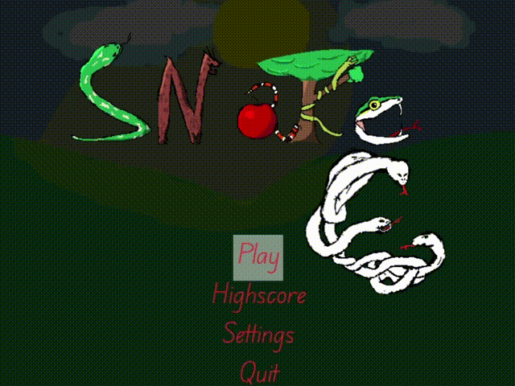
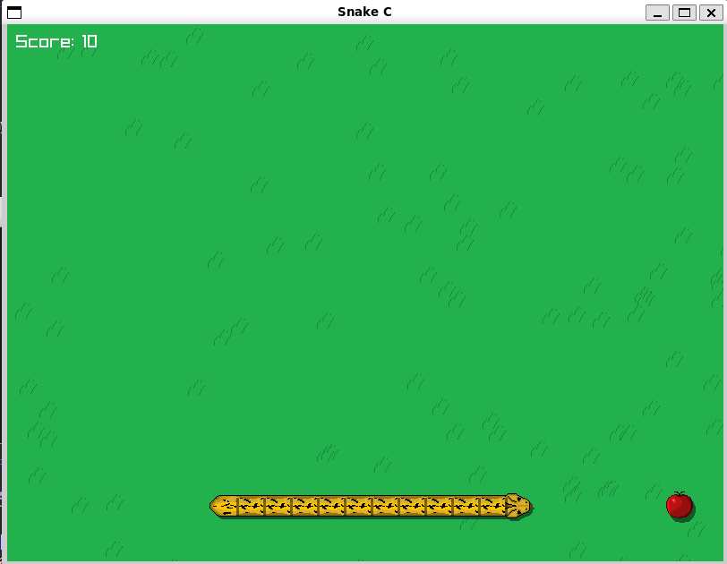
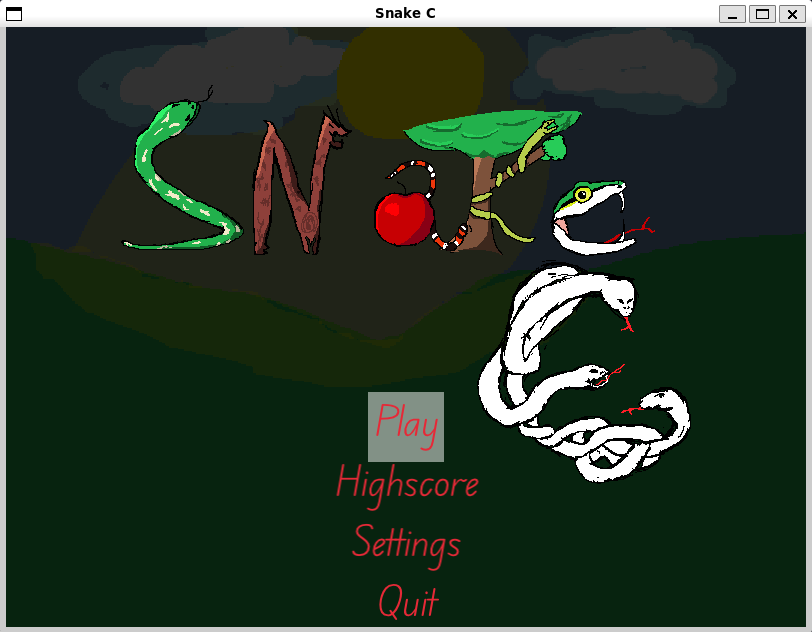

# 🐍 Snake Game in C using Raylib


<div align="center">

</div>

Um jogo da cobrinha desenvolvido em **C utilizando a biblioteca Raylib**.

O objetivo deste projeto é recriar o clássico Snake, mas aproveitando a oportunidade para explorar conceitos importantes de programação de baixo nível, como:

- Gerenciamento manual de memória
- Estruturas de dados em C
- Listas encadeadas
- Filas genéricas
- Organização modular de código
- Renderização 2D
- Animações e gerenciamento de recursos

O projeto ainda está em desenvolvimento e novas funcionalidades serão adicionadas futuramente.

---

## 🎮 Sobre o projeto

A ideia inicial foi criar uma versão simples do Snake, porém o projeto evoluiu para uma implementação mais estruturada, buscando aproximar a arquitetura utilizada em pequenos motores de jogos.

A cobra é construída utilizando uma **lista encadeada**, onde cada segmento representa um nó independente:

```
Head -> Node -> Node -> Node -> NULL
```

Cada nó possui informações como:

- Posição
- Direção
- Curvas realizadas
- Próximo segmento da cobra

O movimento não é baseado apenas em mover sprites, mas sim em atualizar a posição de cada elemento da estrutura de dados.

---

## ✨ Funcionalidades implementadas

### ✅ Sistema da cobra

- Criação dinâmica da cobra
- Crescimento através da adição de novos nós
- Movimento baseado em lista encadeada
- Controle de direção
- Detecção de colisão
- Sistema de curvas para armazenar mudanças de direção

### ✅ Estruturas de dados

O projeto possui implementações próprias de estruturas utilizadas no jogo.

**Lista encadeada**

Utilizada para armazenar os segmentos da cobra:

```
Snake
  |
  v
[Head] -> [Body] -> [Body] -> [Tail]
```

**Fila genérica**

Foi criada uma fila capaz de armazenar diferentes tipos de dados utilizando ponteiros genéricos (`void *`).

Ela é utilizada para armazenar informações de movimento, como curvas realizadas pela cobra.

Operações disponíveis:

- `create_queue()`
- `enqueue()`
- `peek_queue()`
- `dequeue()`

---

## 🖼️ Imagens do projeto

**Gameplay**



**Menu**



---

## 📂 Estrutura do projeto

Exemplo da organização atual:

```
Snake-Game/
│
├── assets/
│   ├── data/
│   │   └── highscore.txt
│   │
│   ├── fonts/
│   │   └── EduVICWANTHand.ttf
│   │
│   ├── sounds/
│   │
│   └── textures/
│       ├── apple/
│       │   └── apple.png
│       │
│       ├── grass/
│       │   ├── Grass_Right1.png
│       │   ├── Grass_Right2.png
│       │   └── Grass_Right3.png
│       │
│       ├── snake/
│       │   ├── snake0.png
│       │   ├── snake1.png
│       │   └── snake2.png
│       │
│       └── title/
│           └── title_background.png
│
├── include/
│   ├── player.h
│   ├── queue.h
│   ├── game_state.h
│   └── ...
│
├── src/
│   ├── main.c
│   ├── player.c
│   ├── queue.c
│   └── ...
│
├── build/
│
├── Makefile
└── README.md
```

---

## ⚙️ Requisitos

Antes de compilar, tenha instalado:

- GCC
- Make
- Raylib

Exemplo no Linux:

```bash
sudo apt install gcc make libraylib-dev
```

Caso esteja utilizando Windows, é necessário possuir um ambiente com GCC configurado, como:

- MinGW
- MSYS2
- WSL

> **Nota:** o `Makefile` linka a raylib manualmente com `-lraylib -lGL -lm -lpthread -ldl -lrt -lX11`. Se der erro de linkagem no seu sistema, tente instalar via `pkg-config` ou ajustar essas flags conforme a sua distro/ambiente.

---

## 🔨 Como executar

Clone o repositório:

```bash
git clone https://github.com/Pedro1516/SnakeC.git
```

Entre na pasta:

```bash
cd Snake-Game
```

Compile utilizando o Makefile:

```bash
make
```

Após a compilação, execute:

```bash
./bin/snake
```

---

## 🧰 Comandos do Makefile

O projeto utiliza um `Makefile` para automatizar o processo de build. Os arquivos `.o` são gerados em `build/` e o executável final em `bin/snake`.

| Comando | Descrição |
|---|---|
| `make` ou `make all` | Compila o projeto e gera o executável em `bin/snake` |
| `make run` | Compila (se necessário) e já executa o jogo em seguida |
| `make debug` | Compila e abre o executável direto no **GDB** para depuração |
| `make clean` | Remove os arquivos de build (`build/`) e o executável (`bin/snake`) |
| `make rebuild` | Executa `clean` e depois `all`, forçando uma recompilação completa |

### Compilar e rodar de uma vez

```bash
make run
```

### Depurar com GDB

```bash
make debug
```

### Recompilar do zero

Útil quando você mexeu em headers ou quer garantir que não há builds antigos causando comportamento estranho:

```bash
make rebuild
```

### Limpar arquivos compilados

```bash
make clean
```

---

## 🛠️ Tecnologias utilizadas

**Linguagem: C**

Escolhida para explorar:

- Controle de memória
- Ponteiros
- Estruturas
- Organização de projetos maiores

**Biblioteca gráfica: Raylib**

Utilizada para:

- Janela do jogo
- Entrada de teclado
- Renderização
- Texturas
- Áudio

---

## 🚧 Próximos passos

Algumas melhorias planejadas:

- [ ] Sons e efeitos
- [ ] Novos modos de jogo
- [ ] Power-ups
---

## 📚 Objetivos de aprendizado

Este projeto está sendo desenvolvido principalmente para praticar:

- Programação em C
- Desenvolvimento de jogos 2D
- Estruturas de dados
- Arquitetura de software
- Manipulação de memória
- Renderização gráfica

---

## 👨‍💻 Autor

Pedro Lucas Freitas Cardoso

Projeto desenvolvido como estudo de programação em C e desenvolvimento de jogos utilizando Raylib.
